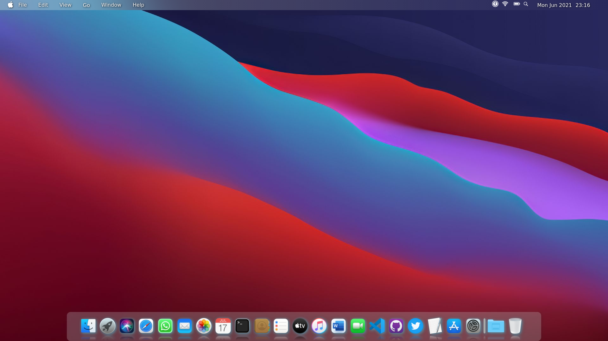
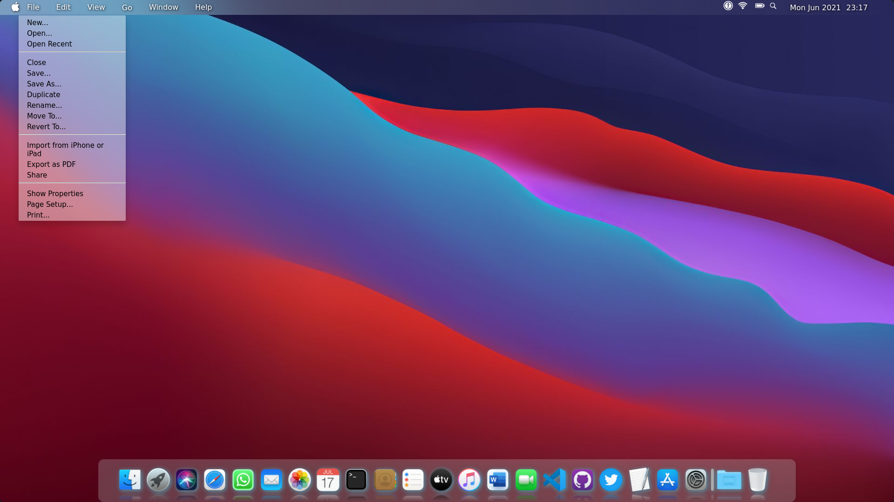
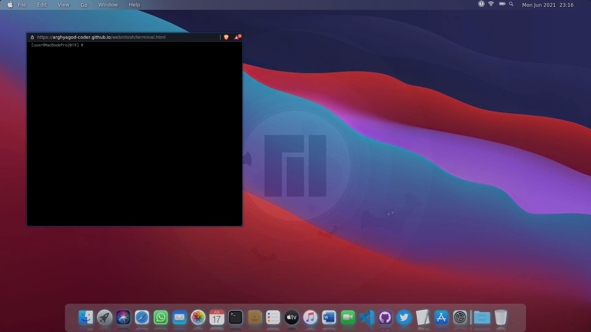
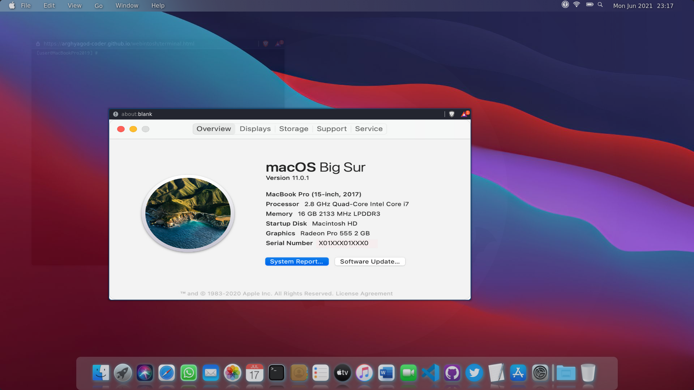

# Webintosh

A MacOS like clone website made for giving a desktop-like experience while working with Web Applications and Websites.

Inspired from MacOS Big Sur, I have tried to make it as familiar as possible to Mac and I think this is tthe most familiar MacOS Clone made in html, css and js

I used purely HTML CSS and JS with no framework but some part of jQuery. I hope you like this!

https://arghyagod-coder.github.io/webintosh/

## Features

- Toggle menus in menu bar just like MacOS.
- Run webapps in an exciting and easy way.
- Background Changes according to time of day.
- Real Time clock and beautiful dock
- OS Like Splash Screen and Login Screen
- Many more...

  
## Screenshots

  
## Deployment

The project was deployed in github pages.
  
## Authors

- [Arghya Sarkar](https://www.github.com/arghyagod-coder)

  
## License

[MIT](https://choosealicense.com/licenses/mit/)

  